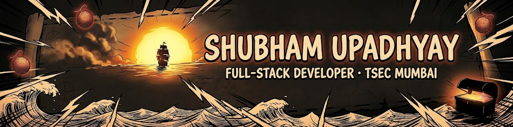
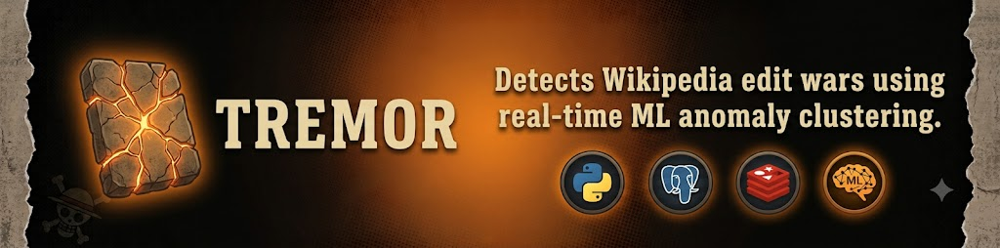
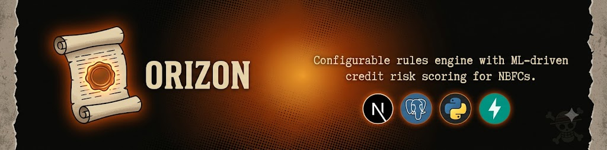
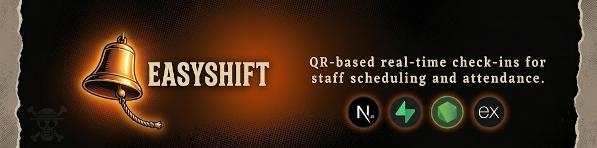

<!--
  ============================================================
  SHUBHAM2775 / README.md
  Palette: bg #0B0B0A | amber #E8A649 | ember #C1440E | cream #E7D9B8 | muted #A9998A
  ============================================================
-->

<!--
  MAIN BANNER — add your own image here.
  Recommended: 1600x400px (or similar wide aspect ratio), dark background,
  ember/amber glow, high contrast, halftone or grain texture.

  Pinterest search tags to try:
  "dark pirate adventure poster banner"
  "one piece amber ember aesthetic wallpaper banner"
  "pirate treasure map dark banner png"
  "sunset silhouette pirate ship banner"
  "grunge halftone poster dark orange"

  Save the file as: assets/banner.png  (then uncomment the line below)
-->
<!--  -->

 

 

 

<!--
  Optional small divider image between sections.
  Pinterest tags: "torn parchment scroll edge png transparent",
  "poneglyph stone texture transparent png"
  Save as: assets/divider.png and drop  anywhere below
-->

## About Me

I'm **Shubham**, a 4th year Information Technology student at **Thadomal Shahani Engineering College, Mumbai**, and a full-stack developer who builds end-to-end, production-shaped projects rather than just demos.

- Learning and applying **AI/ML** on my own terms and not chasing every trend, picking what actually solves the problem in front of me (anomaly detection, embeddings, risk scoring)
- Secured 2nd place at **CODEISSANCE 2026** and top-5 finalist at **CODEISSANCE 2025**
- Quiet by nature, fueled by curiosity, always exploring, building, improving myself.
- Music lover, Marvel and One Piece fan, into anime, badminton, and stargazing with a soft spot for cats.
- Constant need of listening to music, lives in a world of Marvel and One Piece, likes watching anime, and smashes it in badminton.
- The only things I'd love to stalk are the night sky full of stars, and the cats wandering around.
- Reach me at **shubhamu1332@gmail.com**

 

## Tech Stack

**Languages**
 

**Frameworks**
 

**Tools & Platforms**
 

**Databases**
 

**Concepts**
 

 

## Projects

<!--
  Optional per-project banner images.
  Pinterest tags per project theme:
  Tremor    → "cracked stone glowing texture dark", "fracture light crack png"
  Orizon    → "wax seal scroll dark aesthetic", "old ledger parchment glow"
  EasyShift → "ship bell dark glow illustration", "brass bell amber glow"
  Save as: assets/tremor.png, assets/orizon.png, assets/easyshift.png
-->

<table>
<tr>
<td width="100%">

<h3>Tremor — Wikipedia Edit War Detection </h3>

<!-- delete the line above until you've added the image -->

Real-time analytics dashboard that detects active Wikipedia edit wars using genuine unsupervised ML — time-series anomaly scoring on edit activity/revert frequency, plus sentence-embedding clustering to group disputes. An LLM only summarizes findings in plain English; it isn't used for detection. Deployed as a full production pipeline, including fixing real infra issues (memory crashes, API rate-limit failures).

    

</td>
</tr>
</table>

<table>
<tr>
<td width="100%">

<h3>Orizon — Smart Credit Underwriting & Configurable BRE </h3>

<!-- delete the line above until you've added the image -->

Credit underwriting platform for NBFCs combining a configurable Business Rules Engine with XGBoost-based risk scoring and SHAP-driven explainability — includes a PDF bank-statement extraction pipeline and a multi-tier role-based approval workflow with full audit logging. **Runner-up, CODEISSANCE 2026.**

    

</td>
</tr>
</table>

<table>
<tr>
<td width="100%">

<h3>EasyShift — Staff Scheduling & Attendance Platform </h3>

<!-- delete the line above until you've added the image -->

Staff scheduling and attendance platform using QR-based real-time check-ins to automate workforce tracking. Role-based dashboards with multilingual support let managers and staff view schedules and manage shifts through separate access levels. **Top-5 finalist, CODEISSANCE 2025.**

   

</td>
</tr>
</table>

 

## GitHub Stats

 

 

## Contribution Graph

<!--
  If the activity-graph widget above is slow/down, this snake contribution
  animation is a solid drop-in alternative (needs a one-time GitHub Actions
  setup — see github.com/Platane/snk). Ask me to write the workflow file
  if you want it.
-->

 

## Connect

<!-- add LinkedIn once you give me the URL:  -->

 

Built with clean architecture and curiosity

